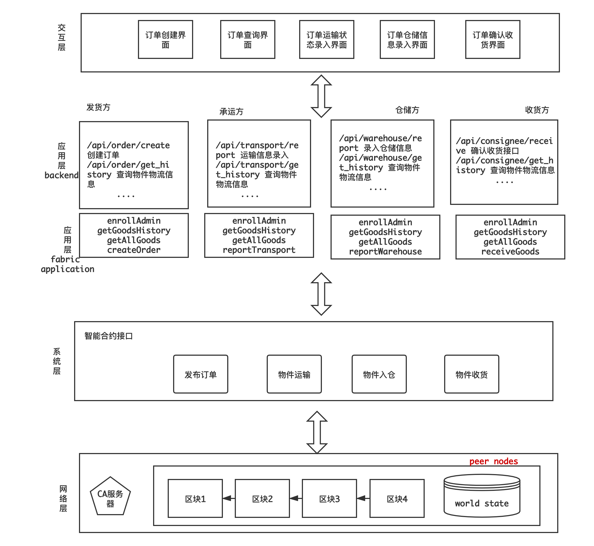

# logistic-system

该项目是基于超级账本 hyperledger fabric（区块链3.0 联盟链框架）的分布式物流管理系统，作为本科毕业设计。

## 开发环境

- OS: darwin x64
- docker: Docker version 19.03.2
- docker-compose: docker-compose version 1.24.1
- node: v12.16.1
- npm: 6.13.4
- Angular CLI: 9.0.3
- nestjs: 6.14.2
- hyperledger fabric: 2.0
  
## 系统架构

该系统基于超级账本，利用区块链的去中心化、去信任化等特点，设计了物流管理系统，提供物件信息录入、查询、溯源等功能，参与组织有四个，分别为：

- shipper，发货方，订单创建者，需要跟踪查询物件信息
- transporter，运输方，负责物件运输，录入每次运输的具体信息
- warehouse，仓储方，负责物件仓储，物件可能不需要该方参与，负责录入每次仓储的详细信息
- consignee，收货方，跟踪物件信息，物件收货后，在系统中确认收货，结束该物件的生命周期



## 系统实现

系统分层设计，包括：区块链网络搭建、chaincode层、fabric application、web后端和web前端。区块链网络由多个peer node和order node组成，采用etcdraft的方案来作为共识机制。node运行在docker container中，使用docker compose来管理。

- chaincode: 根据官方文档，golang、java、node版本的chaincode api比较成熟，因为golang的静态类型、轻便选用golang来实现chaincode。
- fabric application: 官方提供了node和java的SDK，因为决定实现angular来做前端，为了统一技术栈，选用typescript SDK来开发
- backend:  选用使用typescript的nestjs框架
- frontend: 选用使用typescript的angular 9 框架

## 运行

```shell
./install-dependency.sh # 下载依赖，建议npm设置国内registry

./start.sh network # 启动区块链网络
./start.sh backend # 启动后端，提供RESTful api
./start.sh frontend # 启动前端angular server

# 或者
./start.sh all
```

等待系统启动后，分别访问

- `http://localhost:4200/`(shipper)
- `http://localhost:4300/`(transporter)
- `http://localhost:4400/`(warehouse)
- `http://localhost:4500/`(consignee)
  
  来登陆各个organization的管理界面。

## 运行截图


